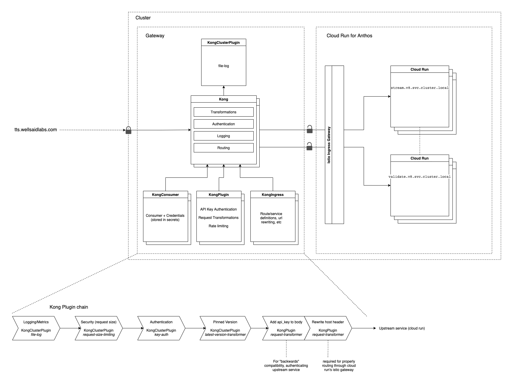

# TTS Operations

This directory contains code and documentation for the infrastructure required
to run the TTS service.

This setup consists of two main parts; a
[Kong API Gateway](https://github.com/Kong/kong) used for traffic control, and
[Cloud Run for Anthos](https://cloud.google.com/anthos/run) that manages our TTS
workers.

The TTS workers are deployed via Google Cloud Run, using Cloud Run for Anthos.
The setup utilizes a GKE cluster as the execution runtime for the Cloud Run
services. Cloud Run for Anthos is powered by knative; the service in charge of
scaling our "serverless" TTS workers.

## Cluster Setup

To setup a new cluster, follow [this guide](./ClusterSetup.md).

## Deploying the Kong gateway

To deploy the Kong gateway service, follow [this guide](./gateway/README.md).

## Deploying individual TTS Workers

To deploy instances of the service, follow [this guide](./run/README.md).

## Monitoring & Metrics

See [this guide](./metrics/README.md) for details creating log-based metrics in
order to better monitor this service.
